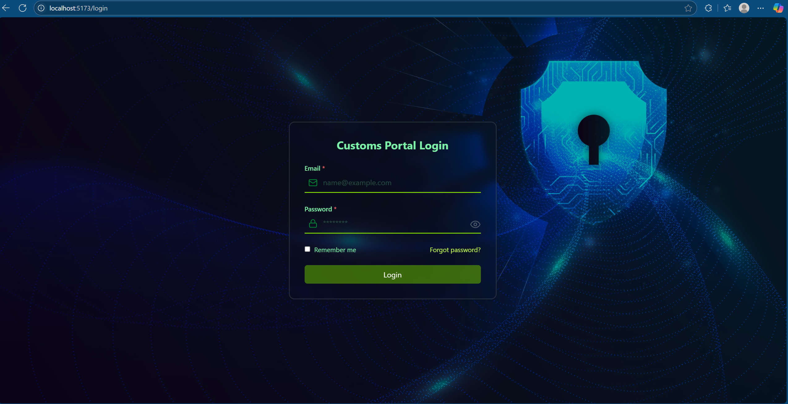
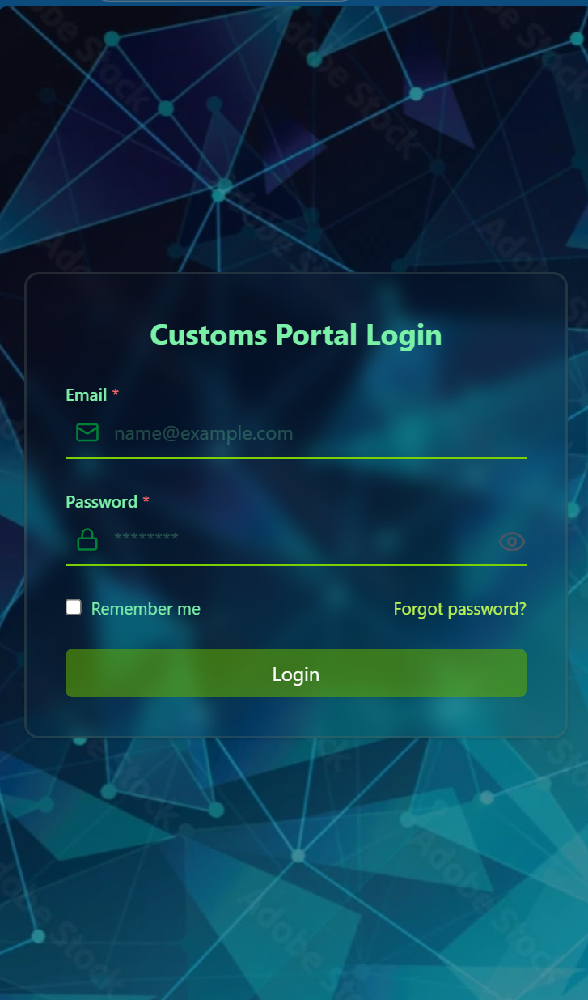
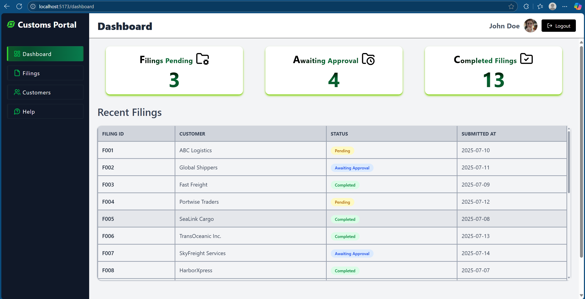
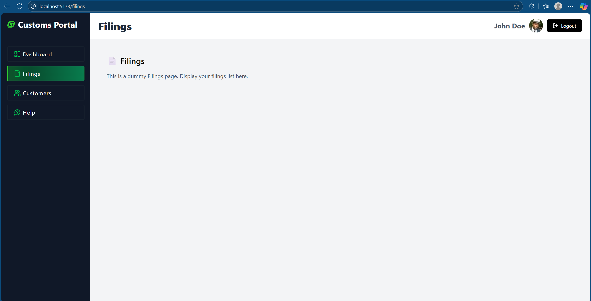

# 📦 Digital Customs Filing Portal

A responsive web app that allows customs brokers and customers to log in, view filing summaries, and manage shipments through an intuitive dashboard. Built with **React**, **React Router**, and **Tailwind CSS**.

---

## ✨ Features

- 🔐 **Login Page** with email/password validation  
- 📊 **Dashboard** with:
  - SideBar , Header and Main Content
  - Filing summary cards (Filings Pending, Awaiting Approval, Completed Filings)
  - Recent filings table  
- 📁 Page routing for: Dashboard, Customers, Filings, and Help  
- ⚡ Fast with **React Lazy Loading** and a custom **Loader** component  

---

## 🧠 Thought Process

The goal was to create a clean, professional portal for digital customs management:

- **Component-Driven**: UI is built with reusable components like `Sidebar`, `Header`, `SummaryCard`, and `RecentFilingsTable`.
- **Scalable Routing**: Handled with `react-router-dom` using nested routes with layout wrappers.
- **Performance-Optimized**: Routes are lazy-loaded using `React.lazy` and `Suspense` to improve initial load performance.
- **Tailwind CSS**: Used for consistent design, fast iteration, and responsive behavior out-of-the-box.

---

## 📷 Screenshots

> Place these screenshots in a `screenshots/` folder in your repo.

### 🔐 Login Page (Desktop & Mobile View)

<div style="display: flex; gap: 12px; align-items: flex-start;">
  
  
</div>

### 📊 Dashboard Page  

### 📁 Dummy Filing Page 

---

## 📁 Folder Structure

  src/
  ├── assets/ # Static files (e.g., login.webp), SVGs
  ├── components/ # Shared UI components
  │ ├── Header.tsx
  │ ├── Sidebar.tsx
  │ ├── SummaryCard.tsx
  | ├── DashboardLayout.tsx
  | ├── Loader.tsx
  │ └── RecentFilingsTable.tsx
  |
  ├── data/
  │ └── dummyFilings.ts # Mock filing data
  ├── pages/
  │ ├── Login.tsx
  │ ├── Dashboard.tsx
  │ ├── Customers.tsx
  │ ├── Filings.tsx
  │ └── Help.tsx
  |
  ├── router.tsx # Routing with lazy loading
  └── App.tsx # Main application entry


## 🚀 Getting Started

Clone the repo and run it locally:

```bash
git clone https://github.com/your-username/dashboard.git
cd dashboard
npm install
npm run dev